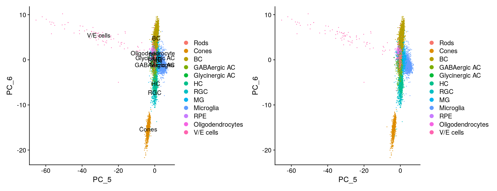
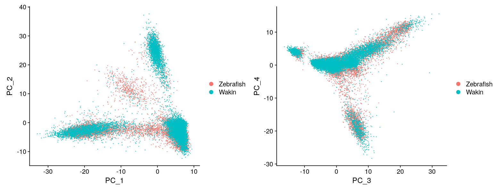

# Single-cell RNA-seq analysis of the goldfish retina

This is the summary R scripts for analysis of single-cell RNA-seq of the goldfish retina. The goldfish retinas were treated by the Neuron dissociation solutions (291-78001, Fujifilm) and followed by gentle pipetting.  
The single-cell RNA-seq libraries were prepared using the 10x Genomics Chromium Single Cell system using the v3.1 chemistry per manufacturer’s instructions.  
Raw fastq files were converted to gene expression matrix (UMI matrix) using cellranger count command.  
Data sets of goldfish and those of zebrafish (Hoang 2020, http://bioinfo.wilmer.jhu.edu/jiewang/scRNAseq/Count_matrix/) were integrated using NormalizeData/FindVariableFeatures/SelectIntegrationFeatures/FindIntegrationAnchors.  
Thereafter, data was scaled and PCA and UMAP were conducted.  
FindNeighbors/FindClusters functions were used to annotated cell types and mark/remove putative doublet cells.  

## Data load


```R
#Load the libraries
library(Matrix)
library(dplyr)
library(Seurat)
library(ggplot2)
```


```R
#Prepare for multi cpu processing
library(future)
plan("multiprocess", workers = 40)
```

    Warning message:
    “Strategy 'multiprocess' is deprecated in future (>= 1.20.0) [2020-10-30]. Instead, explicitly specify either 'multisession' (recommended) or 'multicore'. In the current R session, 'multiprocess' equals 'multicore'.”


```R
#Memory usage
options(future.globals.maxSize = 100 * 1024^3)
```


```R
#Load the gene table
ZF_GF <- read.table(
    file="ZF_LA_SB_symbol_for_Seurat.txt", 
    header=F, 
    row.names=7, 
    stringsAsFactor=F
    )
```


```R
#Load object
dat.combined <- readRDS("dat.combined_v4.rds")
```


```R
#Show the meta data
head(dat.combined)
```


<table class="dataframe">
<caption>A data.frame: 10 × 10</caption>
<thead>
	<tr><th></th><th scope=col>orig.ident</th><th scope=col>nCount_RNA</th><th scope=col>nFeature_RNA</th><th scope=col>CellType</th><th scope=col>Sample</th><th scope=col>integrated_snn_res.0.5</th><th scope=col>seurat_clusters</th><th scope=col>integrated_snn_res.3</th><th scope=col>CellType2</th><th scope=col>Species</th></tr>
	<tr><th></th><th scope=col>&lt;chr&gt;</th><th scope=col>&lt;dbl&gt;</th><th scope=col>&lt;int&gt;</th><th scope=col>&lt;chr&gt;</th><th scope=col>&lt;chr&gt;</th><th scope=col>&lt;fct&gt;</th><th scope=col>&lt;fct&gt;</th><th scope=col>&lt;fct&gt;</th><th scope=col>&lt;fct&gt;</th><th scope=col>&lt;chr&gt;</th></tr>
</thead>
<tbody>
	<tr><th scope=row>zfAd00R1_AAACCTGCAAGAAAGG-zfAd00R1</th><td>Hoang2020</td><td>1994</td><td>1140</td><td>HC</td><td>zfAd00R1</td><td>6</td><td>6</td><td>16</td><td>HC</td><td>Zebrafish</td></tr>
	<tr><th scope=row>zfAd00R1_ACTGCTCAGTGAACAT-zfAd00R1</th><td>Hoang2020</td><td>1120</td><td> 756</td><td>HC</td><td>zfAd00R1</td><td>6</td><td>6</td><td>16</td><td>HC</td><td>Zebrafish</td></tr>
	<tr><th scope=row>zfAd00R1_AGCAGCCTCCGAAGAG-zfAd00R1</th><td>Hoang2020</td><td>1922</td><td>1194</td><td>HC</td><td>zfAd00R1</td><td>6</td><td>6</td><td>16</td><td>HC</td><td>Zebrafish</td></tr>
	<tr><th scope=row>zfAd00R1_AGGTCCGCACTTAACG-zfAd00R1</th><td>Hoang2020</td><td>1190</td><td> 796</td><td>HC</td><td>zfAd00R1</td><td>6</td><td>6</td><td>16</td><td>HC</td><td>Zebrafish</td></tr>
	<tr><th scope=row>zfAd00R1_ATCCGAAGTTTCCACC-zfAd00R1</th><td>Hoang2020</td><td>2696</td><td>1456</td><td>HC</td><td>zfAd00R1</td><td>6</td><td>6</td><td>16</td><td>HC</td><td>Zebrafish</td></tr>
	<tr><th scope=row>zfAd00R1_ATGTGTGGTCCCTTGT-zfAd00R1</th><td>Hoang2020</td><td>1518</td><td>1032</td><td>HC</td><td>zfAd00R1</td><td>6</td><td>6</td><td>16</td><td>HC</td><td>Zebrafish</td></tr>
	<tr><th scope=row>zfAd00R1_CAACCAAAGCTAGTGG-zfAd00R1</th><td>Hoang2020</td><td>2052</td><td>1204</td><td>HC</td><td>zfAd00R1</td><td>6</td><td>6</td><td>16</td><td>HC</td><td>Zebrafish</td></tr>
	<tr><th scope=row>zfAd00R1_CAGAATCGTATTACCG-zfAd00R1</th><td>Hoang2020</td><td>1996</td><td>1202</td><td>HC</td><td>zfAd00R1</td><td>6</td><td>6</td><td>16</td><td>HC</td><td>Zebrafish</td></tr>
	<tr><th scope=row>zfAd00R1_CCGGTAGTCACTTACT-zfAd00R1</th><td>Hoang2020</td><td>1570</td><td>1014</td><td>HC</td><td>zfAd00R1</td><td>6</td><td>6</td><td>16</td><td>HC</td><td>Zebrafish</td></tr>
	<tr><th scope=row>zfAd00R1_CCTTACGAGAGGACGG-zfAd00R1</th><td>Hoang2020</td><td>1492</td><td> 970</td><td>HC</td><td>zfAd00R1</td><td>6</td><td>6</td><td>16</td><td>HC</td><td>Zebrafish</td></tr>
</tbody>
</table>


```R
#Show the general information of the object
dat.combined
```


    An object of class Seurat 
    24888 features across 36533 samples within 2 assays 
    Active assay: integrated (2000 features, 2000 variable features)
     1 other assay present: RNA
     2 dimensional reductions calculated: pca, umap


```R
#Show the cell numbers of each sample
summary(as.factor(dat.combined$orig.ident))
```


<style>
.dl-inline {width: auto; margin:0; padding: 0}
.dl-inline>dt, .dl-inline>dd {float: none; width: auto; display: inline-block}
.dl-inline>dt::after {content: ":\0020"; padding-right: .5ex}
.dl-inline>dt:not(:first-of-type) {padding-left: .5ex}
</style><dl class=dl-inline><dt>Hoang2020</dt><dd>13808</dd><dt>Wakin-1</dt><dd>5171</dd><dt>Wakin-2</dt><dd>10453</dd><dt>Wakin-3</dt><dd>7101</dd></dl>


## PCA plot

PCA was conducted for the initial dimensional reduction.


```R
#Configure the window size
options(repr.plot.width=13, repr.plot.height=5)
```


```R
#Goldfish PCA plot with legend
Idents(dat.combined) <- "CellType2"
DIM <- c(1,2)
DimPlot(subset(dat.combined, Species=="Wakin"), reduction = "pca", dim=DIM, label = TRUE) +
DimPlot(subset(dat.combined, Species=="Wakin"), reduction = "pca", dim=DIM, label = FALSE) + NoLegend()
```


```R
#Goldfish PCA plot with legend
Idents(dat.combined) <- "CellType2"
DIM <- c(3,4)
DimPlot(subset(dat.combined, Species=="Wakin"), reduction = "pca", dim=DIM, label = TRUE) +
DimPlot(subset(dat.combined, Species=="Wakin"), reduction = "pca", dim=DIM, label = FALSE) + NoLegend()
```


```R
#Goldfish PCA plot with legend
DIM <- c(5,6)
DimPlot(subset(dat.combined, Species=="Wakin"), reduction = "pca", dim=DIM, label = TRUE) +
DimPlot(subset(dat.combined, Species=="Wakin"), reduction = "pca", dim=DIM, label = FALSE) + NoLegend()
```





```R
#Goldfish PCA plot with legend
Idents(dat.combined) <- "CellType2"
DIM <- c(7,8)
DimPlot(subset(dat.combined, Species=="Wakin"), reduction = "pca", dim=DIM, label = TRUE) +
DimPlot(subset(dat.combined, Species=="Wakin"), reduction = "pca", dim=DIM, label = FALSE) + NoLegend()
```


```R
#Goldfish and Zebrafish PCA plot with legend
Idents(dat.combined) <- "Species"
DimPlot(dat.combined, reduction = "pca", dim=c(1,2), label = FALSE) +
DimPlot(dat.combined, reduction = "pca", dim=c(3,4), label = FALSE)
```





```R
#Goldfish and Zebrafish PCA plot with legend
Idents(dat.combined) <- "Species"
DimPlot(dat.combined, reduction = "pca", dim=c(5,6), label = FALSE) +
DimPlot(dat.combined, reduction = "pca", dim=c(7,8), label = FALSE)
```


## UMAP plot


```R
#Goldfish PCA plot with legend
Idents(dat.combined) <- "CellType2"
DIM <- c(1,2)
DimPlot(subset(dat.combined, Species=="Wakin"), reduction = "umap", dim=DIM, label = TRUE) +
DimPlot(subset(dat.combined, Species=="Wakin"), reduction = "umap", dim=DIM, label = FALSE) + NoLegend()
```


```R
#Goldfish and Zebrafish PCA plot with legend
DIM <- c(1,2)
DimPlot(dat.combined, reduction = "umap", dim=DIM, split.by="Species")
```


## Ohnolog expressions

In order to handle ohnolog pairs in Seurat, expression data of L-ohnolog sets and S-ohnolog sfets were separately handled in Seurat class object like separate individuals.  
In the metadata table, there are Subgenome slot that tells us the whether the gene is L-ohnolog and S-ohnolog.


```R
# Load object
LS.Wakin.dat.combined <- readRDS("LS.Wakin.dat.combined_v1.rds")
```


```R
#Shw the general information
LS.Wakin.dat.combined
```


    An object of class Seurat 
    11444 features across 45450 samples within 1 assay 
    Active assay: RNA (11444 features, 2000 variable features)
     2 dimensional reductions calculated: pca, umap


```R
#Show the metadata
head(LS.Wakin.dat.combined)
```


<table class="dataframe">
<caption>A data.frame: 10 × 15</caption>
<thead>
	<tr><th></th><th scope=col>orig.ident</th><th scope=col>nCount_RNA</th><th scope=col>nFeature_RNA</th><th scope=col>CellType</th><th scope=col>Sample</th><th scope=col>integrated_snn_res.0.5</th><th scope=col>seurat_clusters</th><th scope=col>integrated_snn_res.3</th><th scope=col>CellType2</th><th scope=col>Species</th><th scope=col>nCount_L</th><th scope=col>nCount_S</th><th scope=col>nCount_L_S_ratio</th><th scope=col>nCount_L_S_ratio_log2</th><th scope=col>Subgenome</th></tr>
	<tr><th></th><th scope=col>&lt;chr&gt;</th><th scope=col>&lt;dbl&gt;</th><th scope=col>&lt;int&gt;</th><th scope=col>&lt;chr&gt;</th><th scope=col>&lt;chr&gt;</th><th scope=col>&lt;chr&gt;</th><th scope=col>&lt;chr&gt;</th><th scope=col>&lt;chr&gt;</th><th scope=col>&lt;fct&gt;</th><th scope=col>&lt;chr&gt;</th><th scope=col>&lt;dbl&gt;</th><th scope=col>&lt;dbl&gt;</th><th scope=col>&lt;dbl&gt;</th><th scope=col>&lt;dbl&gt;</th><th scope=col>&lt;chr&gt;</th></tr>
</thead>
<tbody>
	<tr><th scope=row>L_Wakin-1_AAACCCACACTATCGA-1</th><td>Wakin-1</td><td> 339</td><td> 310</td><td>NA</td><td>NA</td><td>2 </td><td>2 </td><td>2 </td><td>BC              </td><td>Wakin</td><td>185</td><td>154</td><td>1.201299</td><td>0.26459492</td><td>L</td></tr>
	<tr><th scope=row>L_Wakin-1_AAACCCAGTGTCCTAA-1</th><td>Wakin-1</td><td> 568</td><td> 466</td><td>NA</td><td>NA</td><td>1 </td><td>1 </td><td>4 </td><td>MG              </td><td>Wakin</td><td>324</td><td>244</td><td>1.327869</td><td>0.40911267</td><td>L</td></tr>
	<tr><th scope=row>L_Wakin-1_AAACCCATCATGTCAG-1</th><td>Wakin-1</td><td>1775</td><td>1117</td><td>NA</td><td>NA</td><td>1 </td><td>1 </td><td>3 </td><td>MG              </td><td>Wakin</td><td>986</td><td>789</td><td>1.249683</td><td>0.32156235</td><td>L</td></tr>
	<tr><th scope=row>L_Wakin-1_AAACCCATCTAGACCA-1</th><td>Wakin-1</td><td> 436</td><td> 372</td><td>NA</td><td>NA</td><td>5 </td><td>5 </td><td>10</td><td>BC              </td><td>Wakin</td><td>245</td><td>191</td><td>1.282723</td><td>0.35920911</td><td>L</td></tr>
	<tr><th scope=row>L_Wakin-1_AAACGAAAGGCTGTAG-1</th><td>Wakin-1</td><td>1364</td><td> 999</td><td>NA</td><td>NA</td><td>10</td><td>10</td><td>17</td><td>RGC             </td><td>Wakin</td><td>706</td><td>658</td><td>1.072948</td><td>0.10158060</td><td>L</td></tr>
	<tr><th scope=row>L_Wakin-1_AAACGAAAGGTAGTAT-1</th><td>Wakin-1</td><td> 578</td><td> 434</td><td>NA</td><td>NA</td><td>1 </td><td>1 </td><td>4 </td><td>MG              </td><td>Wakin</td><td>291</td><td>287</td><td>1.013937</td><td>0.01996842</td><td>L</td></tr>
	<tr><th scope=row>L_Wakin-1_AAACGAACAATGCTCA-1</th><td>Wakin-1</td><td> 574</td><td> 451</td><td>NA</td><td>NA</td><td>9 </td><td>9 </td><td>12</td><td>MG              </td><td>Wakin</td><td>302</td><td>272</td><td>1.110294</td><td>0.15094190</td><td>L</td></tr>
	<tr><th scope=row>L_Wakin-1_AAACGAACACCGTCGA-1</th><td>Wakin-1</td><td>1021</td><td> 609</td><td>NA</td><td>NA</td><td>3 </td><td>3 </td><td>5 </td><td>Microglia       </td><td>Wakin</td><td>569</td><td>452</td><td>1.258850</td><td>0.33210588</td><td>L</td></tr>
	<tr><th scope=row>L_Wakin-1_AAACGAACAGCCATTA-1</th><td>Wakin-1</td><td> 386</td><td> 335</td><td>NA</td><td>NA</td><td>15</td><td>15</td><td>31</td><td>Oligodendrocytes</td><td>Wakin</td><td>202</td><td>184</td><td>1.097826</td><td>0.13464953</td><td>L</td></tr>
	<tr><th scope=row>L_Wakin-1_AAACGAACAGTGCGCT-1</th><td>Wakin-1</td><td> 541</td><td> 389</td><td>NA</td><td>NA</td><td>3 </td><td>3 </td><td>5 </td><td>Microglia       </td><td>Wakin</td><td>287</td><td>254</td><td>1.129921</td><td>0.17622224</td><td>L</td></tr>
</tbody>
</table>


```R
#DotPlot
target_genes <- c(

#Rod_L
    "ENSDARG00000011886", #pdca
    "ENSDARG00000062305",#rims3

#Rod_S
    "ENSDARG00000052223", #rcvrna
    "ENSDARG00000058803", #grk1a
    
#Cone_L
    "ENSDARG00000015343", #pgd
    "ENSDARG00000062420",#nfia

#Cone_S
    "ENSDARG00000094516", #es1
    "ENSDARG00000101368", #cngb3.2

#BC_L
    "ENSDARG00000001880", #stx3a
    "ENSDARG00000044062", #ctbp2a

#BC_S
    "ENSDARG00000028485", #cabp5b
    "ENSDARG00000086222", #nat16

#GABAergic AC_L
    "ENSDARG00000045944", #slc6a1a
    "ENSDARG00000056566", #necab1

#GABAergic AC_S
    "ENSDARG00000055206", #dtnbp1b
    "ENSDARG00000035852", #cart3

#Glycinergic AC_L
    "ENSDARG00000033411", #cabp1b
    "ENSDARG00000059601", #map1aa

#Glycinergic AC_S
    "ENSDARG00000055115", #dtnbp1a
    "ENSDARG00000070037", #rgs8

#HC_L
    "ENSDARG00000101419", #drp2
    "ENSDARG00000063007", #apc2

#HC_S
    "ENSDARG00000032737", #gria3a
    "ENSDARG00000009336", #aif1l

#RGC_L
    "ENSDARG00000038465", #stmn3
    "ENSDARG00000029885", #rab41

#RGC_S
    "ENSDARG00000076833", #atp1b1b
    "ENSDARG00000037905", #cacna1aa
    
#MG_L
    "ENSDARG00000011166", #cahz
    "ENSDARG00000008816", #glud1a

#MG_S
    "ENSDARG00000068572", #slc16a1b
    "ENSDARG00000099265", #slc7a5

#Microglia_L
    "ENSDARG00000041959", #cxcr4b
    "ENSDARG00000042725", #cebpb

#Microglia_S
    "ENSDARG00000075261", #timp2b
    "ENSDARG00000012450", #vmp1

#RPE_L
    "ENSDARG00000042708", #tuba8l
    "ENSDARG00000094522", #si:ch211-14c7.2

#RPE_S
    "ENSDARG00000056151", #tyrp1b
    "ENSDARG00000101481", #rbp5

#Oligodendrocytes_L
    "ENSDARG00000079824", #ninj2
    "ENSDARG00000087843", #cntn1a

    
#Oligodendrocytes_S
    "ENSDARG00000006202", #erbb3a
    "ENSDARG00000057598", #s100b

#V/E cells_L
    "ENSDARG00000002644", #rgs5a
    "ENSDARG00000005368", #mcamb

#V/E cells_S
    "ENSDARG00000002945", #bgnb
    "ENSDARG00000076292" #tns2a
)
```


```R
#DotPlot
Idents(LS.Wakin.dat.combined) <- "CellType2"
options(repr.plot.width=16, repr.plot.height=18)
DotPlot(LS.Wakin.dat.combined, 
        features = target_genes, 
        dot.scale = 9, cols = c("red", "blue"),
        split.by ="Subgenome") + RotatedAxis() + coord_flip()
```


```R
#Declare the gene list
NS.target_genes <- c(
    #Rod
    "ENSDARG00000089326",#arhgap20
    "ENSDARG00000075211", #chd7
    #Cone
    "ENSDARG00000056511", #arr3a
    "ENSDARG00000030758", #guca1c
    #BC
    "ENSDARG00000002576", #cabp5a
    "ENSDARG00000052016", #cabp2a
    #GABAergic AC
    "ENSDARG00000098240", #meis2a
    "ENSDARG00000038574", #scg2b
    #Glycinergic AC
    "ENSDARG00000018534", #slc6a9
    "ENSDARG00000053205", #ppfia4
    #HC
    "ENSDARG00000045141", #aqp8a.1
    "ENSDARG00000102472", #btbd17b
    #RGC
    "ENSDARG00000005559", #pou4f1
    "ENSDARG00000069737", #pou4f2
    #MG
    "ENSDARG00000025420", #fzd5
    "ENSDARG00000056680", #stc2a
    #Microglia
    "ENSDARG00000076789", #cx32.2
    "ENSDARG00000070542", #mafbb
    #RPE
    "ENSDARG00000051874", #stra6
    "ENSDARG00000045808", #rlbp1b
    #Oligodendrocyte
    "ENSDARG00000042357", #cldnk
    "ENSDARG00000044569", #cldn19
    #V/E cells
    "ENSDARG00000054632", #fli1a
    "ENSDARG00000044365" #angptl3
    )
```


```R
#DotPlot
Idents(LS.Wakin.dat.combined) <- "CellType2"
options(repr.plot.width=16, repr.plot.height=12)
DotPlot(LS.Wakin.dat.combined, 
        features = NS.target_genes, 
        dot.scale = 9, cols = c("red", "blue"),
        split.by ="Subgenome") + RotatedAxis() + coord_flip()
```


```R

```
